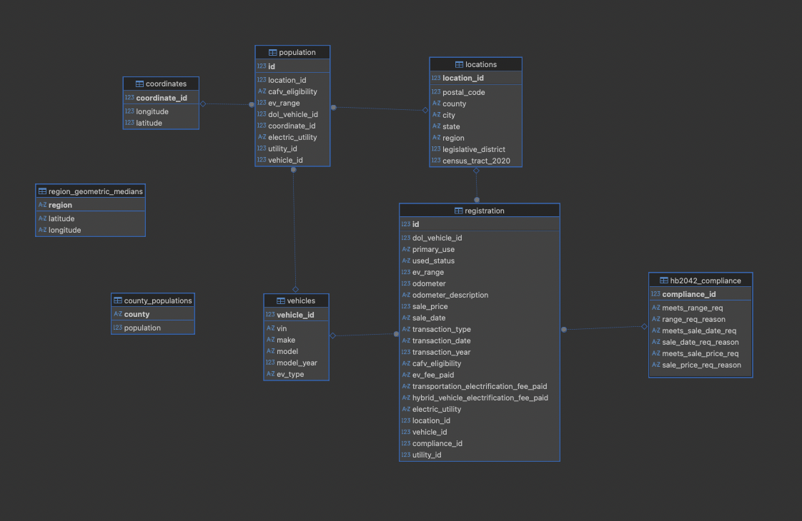
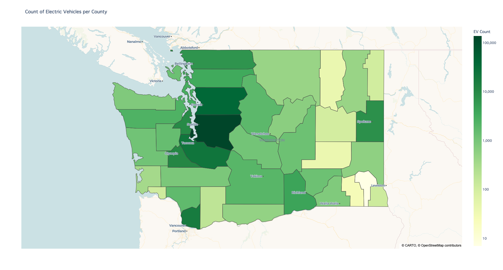
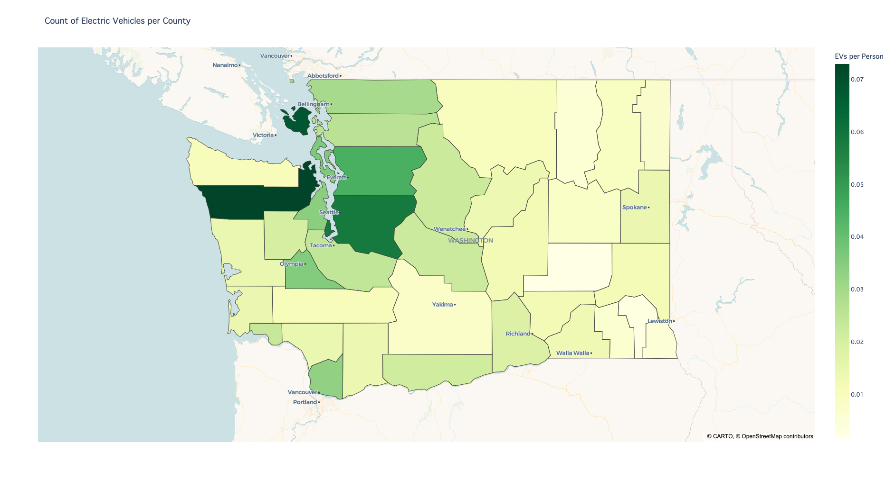

# Analytics Project: Washington Electric Vehicle Dataset

To stray sets of meandering eyes,

This is/was a for-practice end-to-end analytics project using publicly available data from Washington State on their electric vehicle population through the years.

## Introduction to the Data

I used the following triplet of datasets for this project:

- [Electric Vehicle Population](https://catalog.data.gov/dataset/electric-vehicle-population-data?from_hint=eyJzb3J0IjoicG9wdWxhcml0eSJ9) - A snapshot of the population of electric vehicles in Washington State

- [Electric Vehicle Registration Activity by Year](https://data.wa.gov/Transportation/Electric-Vehicle-Registration-Activity-by-Year/tak8-xdcp) -  Registration data for electric vehicles either in or previously in Washington State from 2010 to 2025

- [Resident Population for Counties](https://www.census.gov/data/datasets/time-series/demo/popest/2020s-counties-total.html) - The population of Washington and its counties from 2020 to 2025

## Project Overview

With the goal of this project being end-to-end, that meaning, from ingesting of the raw data to modeling the processed data, I outlined the project as such:

1. Setting up an ETL Pipeline (SQL + Python)
    1. Creating a local [SQLite](https://sqlite.org/index.html) Database to house the data in a [star-like schema](https://en.wikipedia.org/wiki/Star_schema) (Power BI best practice)
    2. Retrieving the data from locally stored .csv and .xlsx files and reformatting it to match the database schema 
    3. Inserting and storing the processed data in the local database for further analysis work
2. EDA (SQL)
    1. Writing some exploratory queries on the data to further check the pipeline and answer some preliminary questions (e.g. most common makes, number of EV registrations per year, etc.)
3. Further Analysis and Visualization (Python + Power BI)
    1. Approximating the geometric median (from EV coordinates) for each of Washington's seven regions, outlined [here](https://stateofwatourism.com/regions/)
    2. Using [Plotly](https://plotly.com/python/) to plot the distribution of electric vehicles in Washington on a per-county level
    3. TODO : Power BI Dashboard

### Brief Interlude on the Business Case of the Weber Problem
*Sample Business Case*  
Let's say that firm _X_ wants to build a single EV charging station in each of Washington's seven regions and are concerned on finding the optimal placement of each station. Optimal placement in this case meaning the location that would minimize the distance from each electric vehicle in the region to that particular charging station. This is the [Weber Problem](https://en.wikipedia.org/wiki/Weber_problem) and the [geometric median](https://en.wikipedia.org/wiki/Geometric_median) of our set of points (our EV coordinates) is the answer we are looking for!

### Database Schema Diagram 
* Facts Tables
    * Population
    * Registration 
* Dimension Tables (name - parent fact table)
    * Locations - Population & Registration
    * Vehicles - Population & Registration 
    * HB2024_Compliance - Registration
    * Coordinates - Population 
* Isolated Tables 
    * Region Geometric Medians 
    * County Populations 

Picture below taken is a screenshot from the [DBeaver](https://dbeaver.io/) tables diagram window  

### Geometric Median Approximations

 * Northwest            -> (long: -122.498583, lat: 48.687590)
 * Peninsulas           -> (long: -122.652754, lat: 47.620572)
 * Southwest            -> (long: -122.575824, lat: 45.688965)
 * Metro Puget Sound    -> (long: -122.236871, lat: 47.611762)
 * North Central        -> (long: -120.304937, lat: 47.414947)
 * Wine Country         -> (long: -119.273720, lat: 46.273910)
 * Eastern              -> (long: -117.377716, lat: 47.656560)

### Plotly Visuals
Visualizing distribution of electric vehicles in Washington state per county using a [tile choropleth map](https://plotly.com/python/tile-county-choropleth/)   
Raw EV Counts  

Normalized by County Population  

## Tech Stack Used

- SQLite
  - Used for data processing and storage
- Microsoft Power BI
  - TO BE USED for data visualization and "dashboarding"
- Python
  - Used for further data processing and geometric median approximation
